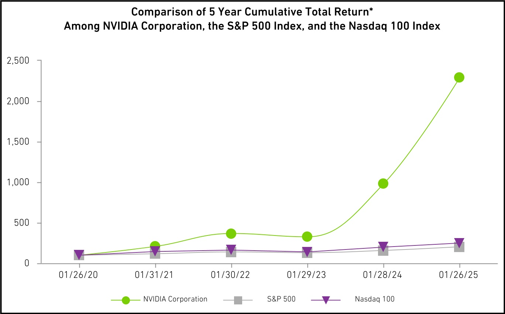

# Chart Vision RAG - Branch Notes

This is a short note for teammates about what the
`feat/chart-vision-extraction` branch adds on top of `main`.

## What this branch does

`main` can retrieve text from 10-K and 10-Q filings, but it cannot search values
that only appear inside a chart image.

This branch adds a second path:

```text
chart image
  -> OpenAI/Gemini vision
  -> structured JSON
  -> text-based Chart Chunk
  -> existing BM25 + vector index
  -> RAG answer with the original image
```

The existing text RAG path is unchanged.

## Main changes

| File                       | Change                                                                                           |
| -------------------------- | ------------------------------------------------------------------------------------------------ |
| `src/finsight/charts.py`   | Finds likely chart images, calls a vision model, validates the result, and creates Chart Chunks. |
| `scripts/ingest_charts.py` | CLI for processing a local image or trying a lightweight scan of SEC filing HTML.                |
| `src/finsight/chunker.py`  | Adds `content_type`, `asset_path`, and `source_url` to `Chunk`.                                  |
| `src/finsight/config.py`   | Adds the chart directory and vision model settings.                                              |
| `src/finsight/index.py`    | Stores text and chart chunks in the same hybrid index.                                           |
| `src/finsight/rag.py`      | Expands chart-related queries and a few Chinese company aliases.                                 |
| `app.py`                   | Loads Chart Chunks and shows the source image and SEC link in the answer.                        |
| `data/sample/charts/`      | Contains three SEC chart samples from Alphabet, NVIDIA, and Meta.                                |

The tests also cover chart loading, candidate detection, schema validation, and
retrieval. The current test result is:

```text
29 passed
```

## Why use vision + JSON + text chunks?

OCR alone can read labels, but it does not reliably understand which colour
belongs to which series or how a point lines up with an axis.

A vision model is useful for getting the chart structure:

- title;
- chart type;
- axes and units;
- legend names;
- data points;
- visible trends.

The model is asked to return JSON instead of free text so that we can validate
the fields and keep estimated values clearly marked.

We then flatten that JSON into text because the project already has a good text
retrieval pipeline. This lets chart evidence and filing text use the same BM25,
vector index, RAG prompt, and citation flow.

The original image is still kept in `asset_path`, so the user can check the
answer against the chart.

## Example

This is the NVIDIA sample:



Its metadata looks roughly like this:

```json
{
  "chunk_id": "NVDA_10-K_2025-01-26#chart-stock-performance",
  "ticker": "NVDA",
  "form": "10-K",
  "date": "2025-01-26",
  "content_type": "chart",
  "asset_path": "data/sample/charts/NVDA_10-K_2025-01-26_stock-performance.jpg",
  "source_url": "https://www.sec.gov/Archives/edgar/data/1045810/000104581025000023/nvda-20250126.htm"
}
```

The searchable text stored in the chunk is similar to:

```text
Company: NVIDIA Corporation.
Chart: Comparison of Five-Year Cumulative Total Return.
Review status: pixel-verified.
Y-axis: Value of $100 investment, USD.

NVIDIA:
2020: 100.0
2023: 331.2 (estimated)
2024: 982.3 (estimated)
2025: 2286.8 (estimated)

S&P 500 in 2025: 202.0 (estimated)
Nasdaq 100 in 2025: 250.0 (estimated)

Finding: NVIDIA finished far above both benchmarks.
Caveat: Values were estimated from the chart image.
```

For this question:

```text
How much was a $100 investment in NVIDIA worth in 2025?
```

the RAG system can retrieve the NVIDIA Chart Chunk and answer that the value was
about `$2,287`, while also showing the chart and its SEC source.

## What works now

- Local chart images can be parsed with OpenAI or Gemini.
- The result is saved as a reusable `*.chart.json` sidecar.
- Chart data is searchable together with normal filing text.
- The UI shows the image when a Chart Chunk is used as a source.
- The three bundled samples work offline after extraction.
- English and basic Chinese chart questions can retrieve the samples.
- Cross-chart questions can compare Alphabet, NVIDIA, and Meta.

## Current limitations

The biggest limitation is ingestion.

The reliable starting point is currently an image that has already been
obtained. `scripts/ingest_charts.py` has a small SEC HTML `` scanner, but
it is not integrated into the main `finsight.ingest` pipeline.

We do not yet have a complete process for:

- extracting every chart from arbitrary 10-K/10-Q HTML;
- rendering PDF filings and detecting chart regions;
- cropping charts from pages;
- handling inline SVG or canvas charts;
- linking each chart to the correct item, caption, footnote, and page;
- removing duplicate images.

That work belongs in ingestion. A future ingestion step should create a
`ChartAsset` containing the image, filing metadata, item/page location,
caption, and surrounding text. The current vision code can then turn that
asset into a sidecar and Chart Chunk.

The other important limitation is numeric accuracy. A vision model can return
valid JSON but still guess the wrong line values. For that reason:

- chart values are marked `estimated`;
- the bundled samples were checked against pixel positions;
- important financial values should be verified against the original image;
- a larger version should add OCR/digitisation or a second-model check.

The existing hallucination audit is also better suited to prose chunks than
Chart Chunks. It expects exact number formatting and high sentence-to-chunk
embedding similarity, so valid rounded values such as `202` versus `202.0`, or
derived statements such as "NVIDIA outperformed both benchmarks", may be
reported as ungrounded. A failed audit on a chart answer can therefore be a
false negative and should be checked against the original image.

The current samples are also all line charts, so bar charts, stacked charts,
dual axes, and more complex layouts still need broader testing.
